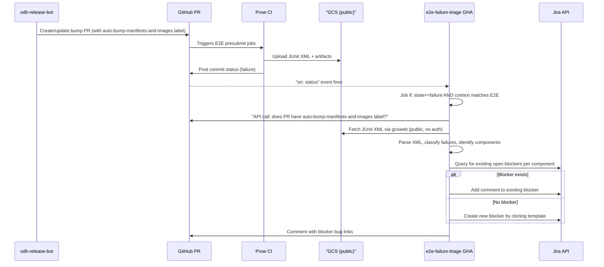

# E2E Failure Detection and Blocker Bug Automation

## Context

When `odh-release-bot[bot]` opens a PR that bumps manifest SHAs and image digests, the Prow E2E presubmit jobs run against that PR. Both manifest SHA updates and image digest updates are performed by the same workflow and land in a single PR. If a component team's changes (delivered via the bump) break the E2E suite, an AICP engineer currently has to manually investigate the failure, identify the responsible component, and file a Jira blocker bug. This automation eliminates that manual work.

**Parent ticket:** [RHOAIENG-80088](https://redhat.atlassian.net/browse/RHOAIENG-80088)
**Blocker bug template:** [RHOAIENG-79740](https://redhat.atlassian.net/browse/RHOAIENG-79740)

## Architecture



## Detailed Breakdown

### 1. Label the bot-authored bump PR

**File to modify:**
- [`.github/workflows/update-manifest-shas.yml`](.github/workflows/update-manifest-shas.yml) — add `labels: auto-bump-manifests-and-images` to the `peter-evans/create-pull-request` step

This is the single workflow that bumps both manifest SHAs and image digests, producing one PR. Once RHOAIENG-80087 (image digest bumps) is merged into this same workflow, it will be covered automatically by the same label.

**Prerequisite:** Create the `auto-bump-manifests-and-images` label in the GitHub repo (one-time, via UI or `gh label create`).

The label serves as the filter signal for the triage workflow. It is applied at PR creation time, before any Prow checks run.

### 2. New GHA workflow: `e2e-failure-triage.yaml`

**File:** `.github/workflows/e2e-failure-triage.yaml`

**Trigger:** `on: status`

This fires on every commit status change across the entire repo. Filtering happens in two layers:

**Layer 1 — Job-level `if:` (free, no runner allocated):**

```yaml
if: >-
  github.event.state == 'failure' &&
  (
    github.event.context == 'ci/prow/opendatahub-operator-e2e' ||
    github.event.context == 'ci/prow/opendatahub-operator-rhoai-e2e'
  )
```

These context strings are confirmed from actual Prow job names in the ci-operator config (`as: opendatahub-operator-e2e` and `as: opendatahub-operator-rhoai-e2e`).

This layer eliminates all non-E2E status events and all non-failure states at zero cost.

**Layer 2 — Step-level label check (~5 seconds of runner time):**

The first step uses `github.event.target_url` (which contains the PR number in the URL path for presubmit jobs) or `github.event.sha` to look up the PR via the GitHub API. It then checks whether the PR carries the `auto-bump-manifests-and-images` label. If not, the workflow exits gracefully (passes).

**Remaining steps** invoke the Python triage script, then post a summary comment on the PR.

**Exit code behavior:**
- The workflow always succeeds (exit 0) when the triage script runs to completion, regardless of whether E2E tests passed or failed
- The workflow only fails if the automation itself errors (cannot fetch artifacts, cannot reach Jira, cannot parse JUnit XML, etc.)

**Permissions needed:**
- `pull-requests: write` (to comment on the PR)
- `statuses: read` (implicit from the status event)

**Secrets needed:**
- `JIRA_API_TOKEN` — Jira personal access token or API token for authentication
- `JIRA_USER_EMAIL` — email address associated with the Jira API token

### 3. Python triage script

**Location:** `.github/scripts/e2e-failure-triage/triage.py` (with `requirements.txt`)

The script is the core logic, invoked by the GHA workflow with just the Prow job URL. The PR number and E2E suite context are derived from the URL automatically. Jira credentials come from environment variables.

#### 3a. Fetch Prow artifacts

- Extract the GCS bucket path from the Prow job URL (`github.event.target_url`)
- Construct the gcsweb URL: `https://gcsweb-ci.apps.ci.l2s4.p1.openshiftapps.com/gcs/test-platform-results/{bucket-path}/`
- Download the JUnit XML file at the confirmed path within the artifact tree. The path uses the Prow job's `as:` name as the directory, confirmed from both ODH and RHOAI E2E runs:
  ```
  artifacts/{job-as-name}/e2e/artifacts/junit_report.xml
  ```
  Where `{job-as-name}` is:
  - `opendatahub-operator-e2e` for the ODH E2E job
  - `opendatahub-operator-rhoai-e2e` for the RHOAI E2E job

  The script should derive `{job-as-name}` from the Prow job URL (it appears in the URL path as part of `pull-ci-opendatahub-io-opendatahub-operator-main-{job-as-name}`).
- GCS artifacts are public, no authentication required
- Retry fetching up to 3 times with short delays, since there can be a brief window between Prow posting the failure status and the artifacts finishing upload
#### 3b. Failure classification and decision logic

The script must distinguish between infrastructure issues (CI cluster problems before tests ran) and genuine component test failures. This happens at two levels:

**Level 0: Did the Prow job pass overall?**

Before examining test results, the script fetches `finished.json` from the Prow artifact root (`{gcs_path}/finished.json`). This file contains `"passed": true/false` and `"result": "SUCCESS"/"FAILURE"`. If the job passed overall, the script short-circuits immediately — no JUnit XML is fetched and no blockers are filed. This prevents false positives from runs where individual tests failed but passed on retry (the overall job succeeded).

**Level 1: Is there test data to analyze?**

If the JUnit XML file does not exist at the expected path, the Prow job failed before the E2E test suite started. Real examples confirmed from PRs #3802, #3813, #3888:
- Cluster preflight health check timed out
- Cluster provisioning failed
- Operator install step failed

In these cases there is no component to blame. The script logs the situation, exits cleanly, and does not file any blocker bugs.

**Level 2: Flaky vs truly failed**

When the JUnit XML exists, the `test-retry` tool records **all attempts** for each test. Flaky tests (failed then passed on retry) appear as multiple `<testcase>` entries with the same name — some with `<failure>` elements and at least one without. A test is only considered truly failed if every entry for that test name has a `<failure>` element.

The script first collects all test names that have at least one passing entry, then excludes those from the failure list. This ensures flaky tests are treated as passes, consistent with how the E2E suite determines overall pass/fail.

Note: the `test-retry` classifier's `failure.category` property (infrastructure/test/unknown) is **not** used for filtering. If the E2E test suite ran and a component test failed (for any reason — bad image, assertion error, timeout, probe failure), that is the component team's problem. The only true infrastructure failures are when the Prow job dies before the test suite starts (Level 1).

**Level 3: Scope filtering**

After flaky exclusion, only failures from component tests are in scope:
- **Include:** test names matching `TestOdhOperator/components/group_\d+/{component}/...`
- **Exclude:** service tests (`TestOdhOperator/services/...`), operator management tests, validation tests, monitoring tests, etc.
- **Exclude:** parent-level entries like `TestOdhOperator`, `TestOdhOperator/components`, `TestOdhOperator/components/group_1` — these are aggregate failures that propagate up from child tests and don't represent a specific component

**Summary of all exit paths:**

| Situation | JUnit XML? | Blocker filed? | PR comment says |
|---|---|---|---|
| Prow job passed overall (finished.json) | Not fetched | No | (script exits early) |
| Job failed before E2E ran | Missing | No | "Prow job failed before E2E tests ran (infrastructure)" |
| E2E ran, all component tests passed | Present, 0 component failures | No | Nothing (or "All component tests passed") |
| E2E ran, component failures all flaky (passed on retry) | Present, all flaky | No | "No actionable component failures (all passed on retry)" |
| E2E ran, component tests truly failed | Present, actionable failures found | Yes | Lists new/existing blockers per component |
| E2E ran, only services/non-component tests failed | Present, no component-scoped failures | No | "No component test failures detected" |

#### 3c. Extract component names from test paths

Test names in the JUnit XML follow the hierarchy from `controller_test.go`. Confirmed from actual Prow artifacts, the format uses underscores for spaces in group names:

```
TestOdhOperator/components/group_1/dashboard/Validate_component_enabled
TestOdhOperator/components/group_1/kserve/Validate_component_enabled
TestOdhOperator/components/group_3/trustyai/Validate_component_enabled
```

The component name is the segment after `group_N/` in the path. The script parses test names matching the pattern `TestOdhOperator/components/group_\d+/(\w+)/` to extract the component name.

**Scope:** Only `components` test failures are in scope. Service test failures (`TestOdhOperator/services/...` for monitoring, auth, gateway) are excluded — services are owned by AICP, not external component teams.

### 4. Component-to-Jira mapping file

**File:** `.github/scripts/e2e-failure-triage/component-mapping.yaml`

A YAML config mapping test component names to Jira component field values. Only `jira_component` is needed — the team field is not set since some components span multiple teams.

```yaml
components:
  dashboard:
    jira_component: "Dashboard"
  kserve:
    jira_component: "KServe"
  ray:
    jira_component: "Ray"
  # ... all components from controller_test.go
```

The full list of components comes from the `Components` test group in [`tests/e2e/controller_test.go`](tests/e2e/controller_test.go) (lines 137-181):
- dashboard, ray, model-registry, training-operator, trainer, datasciencepipelines, workbenches, kserve, feast-operator, ogx, spark-operator, ai-gateway, mcp-lifecycle-operator, kueue, trustyai, mlflow-operator, models-as-service

This file needs to be maintained as components are added or removed. Mapping accuracy is critical — an incorrect mapping means the wrong component gets the bug.

### 5. Jira integration

#### Authentication
- Use Jira REST API v3 with Basic Auth (email + API token)
- Credentials stored as GitHub Actions secrets: `JIRA_USER_EMAIL` and `JIRA_API_TOKEN`
- The token needs permissions to: search issues, create issues, add comments, set fields

#### Deduplication query
Before filing a new blocker, query Jira:
```
project = RHOAIENG
  AND type = Bug
  AND resolution = Unresolved
  AND labels = "odh-operator-auto-e2e-blocker"
  AND component = "{jira_component_name}"
```

- **If an open blocker exists:** add a comment to the existing ticket with:
  - Timestamp of the new failure
  - Link to the Prow run
  - Link to the bump PR
  - Which E2E suite failed (ODH, RHOAI, or both)
- **If no open blocker exists:** create a new ticket (see below)

#### Creating a new blocker bug
Jira does not have a native "clone" API. The process uses the stable public API in three steps:

1. `GET /rest/api/3/issue/RHOAIENG-79740` — read the template's fields
2. `POST /rest/api/3/issue` — create a new issue, copying relevant fields from the template and overriding:
   - **Summary:** `[Auto] E2E blocker: {component} tests failing`
   - **Component:** set to the mapped Jira component
   - **Labels:** include `odh-operator-auto-e2e-blocker` (critical for dedup) plus any labels from the template
   - **Priority:** Blocker (from template)
   - **Description:** populated with:
     - Component name
     - Link to the failing bump PR
     - Link to the Prow build log
     - List of specific failed test names and their failure output (truncated if long)
     - Which E2E suite(s) failed
     - Timestamp
   - **Affects Version:** computed from the `VERSION` variable in the repo's Makefile (parsed dynamically, not by line number). The VERSION value follows semver: `3.5.0` for GA or `3.6.0-ea.1` for EA releases. The script converts this to the Jira Affects Version format:
     - `3.5.0` → `3.5 GA RHOAI RELEASE`
     - `3.6.0-ea.1` → `3.6 EA1 RHOAI RELEASE`
     - `3.6.0-ea.2` → `3.6 EA2 RHOAI RELEASE`
3. `POST /rest/api/3/issueLink` — create a "Cloners" link between the new issue and the template, so the new issue shows "clones RHOAIENG-79740" and the template shows "is cloned by RHOAIENG-XXXXX":
   ```json
   {
     "type": {"name": "Cloners"},
     "inwardIssue": {"key": "RHOAIENG-XXXXX"},
     "outwardIssue": {"key": "RHOAIENG-79740"}
   }
   ```
   This is the same link type already used by manual clones of the template (confirmed from RHOAIENG-80313).

#### Race condition mitigation
If both ODH E2E and RHOAI E2E fail at roughly the same time for the same component, two workflow runs may try to create the same blocker simultaneously. Mitigation:
- Re-query Jira immediately before the `POST` (narrow the race window)
- If the `POST` results in a clearly duplicated ticket (detectable by the operator reviewing), it's a minor nuisance, not a correctness issue — one of the two can be closed as duplicate
- In practice, the two E2E suites rarely finish at the exact same second, so this is unlikely to occur often

### 6. PR comment

After processing all failed components, the GHA posts a single structured comment on the PR summarizing the outcome. Examples:

**New blockers filed:**
> **E2E Failure Triage**
>
> The following component E2E failures were detected and blocker bugs have been filed:
> - **dashboard**: [RHOAIENG-80200](https://redhat.atlassian.net/browse/RHOAIENG-80200) (new)
> - **kserve**: [RHOAIENG-80201](https://redhat.atlassian.net/browse/RHOAIENG-80201) (new)
>
> Prow run: [link]

**Mix of new and existing:**
> **E2E Failure Triage**
>
> - **dashboard**: [RHOAIENG-80150](https://redhat.atlassian.net/browse/RHOAIENG-80150) (existing, comment added)
> - **kserve**: [RHOAIENG-80201](https://redhat.atlassian.net/browse/RHOAIENG-80201) (new)
>
> Prow run: [link]

**Infra failure (no JUnit XML):**
> ## E2E Failure Triage
>
> Prow job failed before E2E tests ran (infrastructure).
> No component blocker bugs filed.
>
> [Prow run](link)

**No actionable failures (pass or all flaky):**
> ## E2E Failure Triage
>
> No actionable component test failures detected.
> (N flaky test(s) passed on retry)
>
> [Prow run](link)

The comment uses `thollander/actions-comment-pull-request` with `comment-tag: e2e-failure-triage` and `mode: upsert`, consistent with existing repo patterns. The script writes the comment body to a file via `--comment-output`, and the GHA step posts it.

### 7. File structure summary

```
.github/
  workflows/
    e2e-failure-triage.yaml          # New workflow
    update-manifest-shas.yml         # Modified (add auto-bump-manifests-and-images label)
  scripts/
    e2e-failure-triage/
      triage.py                      # Main script (artifact fetch, JUnit parse, Jira integration, PR comment)
      component-mapping.yaml         # Component name -> Jira component mapping
      requirements.txt               # Python dependencies (requests, pyyaml)
```

### 8. Testing strategy

- **Dry-run mode:** The `--dry-run` flag runs the full pipeline (fetch artifacts, parse XML, query Jira for dedup) but skips all Jira write operations (create issue, create link, add comment). It logs what it *would* have done. The GHA workflow ships with `--dry-run` hardcoded on.
- **Local testing:** The script can be run locally against any Prow job URL:
  ```bash
  python .github/scripts/e2e-failure-triage/triage.py \
    --prow-url "<PROW_URL>" \
    --dry-run
  ```
  The PR number and E2E suite context are derived from the URL automatically. No additional flags needed.
- **Validated against 9 real Prow runs** covering all scenarios: pass, test failure, infra failure (no JUnit XML), flaky (all passed on retry), and passing run with JUnit failures (short-circuited by `finished.json` check).
- **Staged rollout:** Push to fork for GHA flow testing, then PR to upstream with `--dry-run` on. Monitor for a few days, then remove `--dry-run` to enable Jira writes.

## Open Items to Resolve During Implementation

- Determine the Jira API token — who owns it, what service account to use, what permissions it needs
